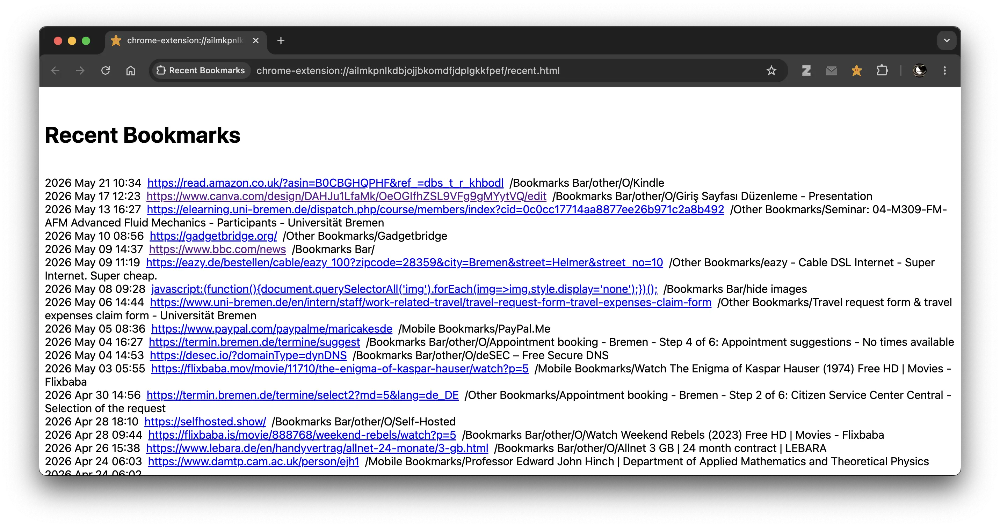

#Recent Bookmarks
A minimal Chrome extension that opens a full-page view of recent bookmarks sorted by creation date.


##Features
*Sorted by `dateAdded`
*Folder path shown beside each bookmark
*Excludes folders named `New folder`
*Opens bookmarks in a new tab
*Minimal styling
*No tracking
*No network access
##Installation
###Load unpacked extension
1. Clone or download this repository
2. Open Chrome:
```text
chrome://extensions
````
3. Enable `Developer mode`
4. Click `Load unpacked`
5. Select the extension folder
##Usage
Click the extension icon in the Chrome toolbar.
A new tab opens showing recent bookmarks.
##Files
*`background.js` Opens `recent.html` when icon clicked
*`manifest.json` Chrome extension manifest (MV3)
*`recent.html  ` Main page
*`recent.js    ` Bookmark traversal + rendering
*`star16.png   ` Toolbar icon
*`star32.png   ` HiDPI icon
*`star48.png   ` Extensions page icon
*`star128.png  ` Large icon
